[](https://scorecard.dev/viewer/?uri=github.com/Azure/Azure-Governance-Visualizer-Accelerator)

# Azure Governance Visualizer (AzGovViz) accelerator

[Azure Governance Visualizer](https://github.com/Azure/Azure-Governance-Visualizer) is a PowerShell based script that iterates your Azure tenant's management group hierarchy down to the subscription level. It captures most relevant Azure governance capabilities such as Azure Policy, role-based access control (RBAC), Blueprints, and a lot more. From the collected data Azure Governance Visualizer provides visibility on your HierarchyMap, creates a TenantSummary, creates DefinitionInsights and builds granular ScopeInsights on management groups and subscriptions.

**This accelerator speeds up the adoption of Azure Governance Visualizer into your environment.**

## Table of contents

- [Azure Governance Visualizer (AzGovViz) accelerator](#azure-governance-visualizer-azgovviz-accelerator)
  - [Table of contents](#table-of-contents)
  - [:rocket: Deployment guide](#rocket-deployment-guide)
    - [1. Create a service principal (Microsoft Entra ID app registration) to run Azure Governance Visualizer](#1-create-a-service-principal-microsoft-entra-id-app-registration-to-run-azure-governance-visualizer)
    - [2. Create copy of the Azure Governance Visualizer accerlator in your own GitHub repository](#2-create-copy-of-the-azure-governance-visualizer-accerlator-in-your-own-github-repository)
    - [3. Configure federated credentials for the service principal created in the first step](#3-configure-federated-credentials-for-the-service-principal-created-in-the-first-step)
    - [4. Grant permissions in Azure for the AzGovViz service principal created in the first step](#4-grant-permissions-in-azure-for-the-azgovviz-service-principal-created-in-the-first-step)
    - [5. Create a Microsoft Entra application for user authentication to the Azure Web App that will host AzGovViz](#5-create-a-microsoft-entra-application-for-user-authentication-to-the-azure-web-app-that-will-host-azgovviz)
    - [6. Create a resource group and assign necessary RBAC roles](#6-create-a-resource-group-and-assign-necessary-rbac-roles)
    - [7. Create the GitHub secrets, variables, and permissions](#7-create-the-github-secrets-variables-and-permissions)
    - [8. Deploy Azure Governance Visualizer Azure resources and application](#8-deploy-azure-governance-visualizer-azure-resources-and-application)
  - [:checkered\_flag: Try it out!](#checkered_flag-try-it-out)
  - [:broom: Clean up resources](#broom-clean-up-resources)
  - [Additional topics](#additional-topics)
    - [Azure Web App configuration](#azure-web-app-configuration)
    - [Keep the Azure Governance Visualizer code up-to-date](#keep-the-azure-governance-visualizer-code-up-to-date)
    - [Keep the Azure Governance Visualizer Accelerator code up-to-date](#keep-the-azure-governance-visualizer-accelerator-code-up-to-date)
  - [Sources to documentation](#sources-to-documentation)

## :rocket: Deployment guide

Follow these steps to deploy the Azure Governance Visualizer accelerator into your own Azure and Microsoft Entra ID tenant. Most steps have both **portal based** ( :computer_mouse: ) and **PowerShell based** ( :keyboard: ) instructions. Use whichever you feel is appropriate for your situation, they both produce the same results.

### Deployment Process Overview

```mermaid
flowchart TD
    Start([Start]) --> Step1["<a href='#1-create-a-service-principal-microsoft-entra-id-app-registration-to-run-azure-governance-visualizer'>1. Create AzGovViz Service Principal<br/>(Microsoft Entra ID)</a>"]
    Step1 --> Step2["<a href='#2-create-copy-of-the-azure-governance-visualizer-accerlator-in-your-own-github-repository'>2. Create Private GitHub Repository<br/>(from accelerator template)</a>"]
    Step2 --> Step3["<a href='#3-configure-federated-credentials-for-the-service-principal-created-in-the-first-step'>3. Configure Federated Credentials<br/>(GitHub Actions → Azure)</a>"]
    Step3 --> Step4["<a href='#4-grant-permissions-in-azure-for-the-azgovviz-service-principal-created-in-the-first-step'>4. Grant Azure Permissions<br/>(Reader role on Management Group)</a>"]
    Step4 --> Step5["<a href='#5-create-a-microsoft-entra-application-for-user-authentication-to-the-azure-web-app-that-will-host-azgovviz'>5. Create Web App Auth Application<br/>(Microsoft Entra ID)</a>"]
    Step5 --> Step6["<a href='#6-create-a-resource-group-and-assign-necessary-rbac-roles'>6. Create Resource Group<br/>(and assign RBAC roles)</a>"]
    Step6 --> Step7["<a href='#7-create-the-github-secrets-variables-and-permissions'>7. Configure GitHub Secrets & Variables<br/>(CLIENT_ID, SUBSCRIPTION_ID, etc.)</a>"]
    Step7 --> Step8a["<a href='#8-deploy-azure-governance-visualizer-azure-resources-and-application'>8a. Run DeployAzGovVizAccelerator<br/>(Deploy Web App + Auth)</a>"]
    Step8a --> Step8b["<a href='#8-deploy-azure-governance-visualizer-azure-resources-and-application'>Workflow: SyncAzGovViz<br/>(Sync latest code)</a>"]
    Step8b --> Step8c["<a href='#8-deploy-azure-governance-visualizer-azure-resources-and-application'>8b. Run DeployAzGovViz<br/>(Deploy & Publish AzGovViz)</a>"]
    Step8c --> End(["✓ Access Web App<br/>via Azure Portal"])
    
    style Start fill:#2E7D32,color:#FFFFFF
    style End fill:#2E7D32,color:#FFFFFF
    style Step1 fill:#1565C0,color:#FFFFFF
    style Step2 fill:#1565C0,color:#FFFFFF
    style Step3 fill:#1565C0,color:#FFFFFF
    style Step4 fill:#1565C0,color:#FFFFFF
    style Step5 fill:#1565C0,color:#FFFFFF
    style Step6 fill:#1565C0,color:#FFFFFF
    style Step7 fill:#1565C0,color:#FFFFFF
    style Step8a fill:#C2185B,color:#FFFFFF
    style Step8b fill:#C2185B,color:#FFFFFF
    style Step8c fill:#C2185B,color:#FFFFFF
```



### Azure Governance Visualizer Accelerator Implementation Flow Architecture


### 1. Create a service principal (Microsoft Entra ID app registration) to run Azure Governance Visualizer

> NOTE: To grant API permissions and grant admin consent for the directory, you must have 'Privileged Role Administrator' or 'Global Administrator' role assigned. See [Assign Microsoft Entra roles to users](https://learn.microsoft.com/entra/identity/role-based-access-control/manage-roles-portal) for instructions.

**:computer_mouse: Use the Microsoft Entra admin center to create the service principal:**

1. Navigate to the [Microsoft Entra admin center](https://entra.microsoft.com/)
1. Click on '**App registrations**'
1. Click on '**New registration**'
1. Name your application (e.g. _AzureGovernanceVisualizer_SP_)
1. Click '**Register**'
1. Your App registration has been created. In the '**Overview**' copy the '**Application (client) ID**' as you will need it later to setup the secrets in GitHub.
1. Under '**Manage**' click on '**API permissions**'
   1. Click on '**Add a permissions**'
   1. Click on '**Microsoft Graph**'
   1. Click on '**Application permissions**'
   1. Select the following set of permissions and click '**Add permissions**'
      - **Application / Application.Read.All**
      - **Group / Group.Read.All**
      - **User / User.Read.All**
      - **PrivilegedAccess / PrivilegedAccess.Read.AzureResources**
   1. Click on 'Add a permissions'
1. Back in the main '**API permissions**' menu you will find permissions with status 'Not granted for...'. Click on '**Grant admin consent for _TenantName_**' and confirm by click on '**Yes**'. Now you will find the permissions with status '**Granted for _TenantName_**'

**:keyboard: Use PowerShell to create the service principal:**

1. Install [AzAPICall](https://github.com/JulianHayward/AzAPICall) and connect to Azure

   ```powershell
   $module = Get-Module -Name "AzAPICall" -ListAvailable
   if ($module) {
     Update-Module -Name "AzAPICall" -Force
   } else {
     Install-Module -Name AzAPICall
   }
   Connect-AzAccount
   ```

1. Initialize AzAPICall

   ```powershell
   $parameters4AzAPICallModule = @{
     #SubscriptionId4AzContext = $null #specify Subscription Id
     #DebugAzAPICall = $true
     #WriteMethod = 'Output' #Debug, Error, Host, Information, Output, Progress, Verbose, Warning (default: host)
     #DebugWriteMethod = 'Warning' #Debug, Error, Host, Information, Output, Progress, Verbose, Warning (default: host)
     #SkipAzContextSubscriptionValidation = $true #Use if the account doesn´t have any permissions on Management Groups,  Subscriptions, Resource Groups or Resources
   }
 
   $azAPICallConf = initAzAPICall @parameters4AzAPICallModule
   ```

1. Define variables

   ```powershell
   $MicrosoftGraphAppId = "00000003-0000-0000-c000-000000000000"
   $AzGovVizAppName = "<App registration name that will be used to run AzGovViz>"
   ```

1. Get Microsoft Graph permissions role IDs and the create app registration

   ```powershell
   $apiEndPoint = $azAPICallConf['azAPIEndpointUrls'].MicrosoftGraph
   $apiEndPointVersion = '/v1.0'
   $api = '/servicePrincipals'
   $optionalQueryParameters = "?`$filter=(displayName eq 'Microsoft Graph')&$count=true&"

   $uri = $apiEndPoint + $apiEndPointVersion + $api + $optionalQueryParameters

   $azAPICallPayload = @{
       uri= $uri
       method= 'GET'
       currentTask= "'$($azAPICallConf['azAPIEndpoints'].($apiEndPoint.split('/')[2])) API: Get - Groups'"
       consistencyLevel= 'eventual'
       noPaging= $true
       AzAPICallConfiguration = $azAPICallConf
   }

   $graphApp = AzAPICall @azAPICallPayload
   $appRole = $graphApp.appRoles | Where-Object { $_.value -eq 'Application.Read.All' } | Select-Object -ExpandProperty id
   $userRole = $graphApp.appRoles | Where-Object { $_.value -eq 'User.Read.All' } | Select-Object -ExpandProperty id
   $groupRole = $graphApp.appRoles | Where-Object { $_.value -eq 'Group.Read.All' } | Select-Object -ExpandProperty id
   $pimRole = $graphApp.appRoles | Where-Object { $_.value -eq 'PrivilegedAccess.Read.AzureResources' } | Select-Object  -ExpandProperty id

   $body = @"
   {
     "DisplayName":"$AzGovVizAppName",
     "requiredResourceAccess" : [
       {
         "resourceAppId" : "$MicrosoftGraphAppId",
         "resourceAccess": [
           {
             "id": "$appRole",
             "type": "Role"
           },
           {
             "id": "$userRole",
             "type": "Role"
           },
           {
             "id": "$groupRole",
             "type": "Role"
           },
           {
             "id": "$pimRole",
             "type": "Role"
           }
         ]
       }
     ]
   }
   "@

   $AzGovVizAppObjectId = (AzAPICall -method POST -body $body -uri "$($azAPICallConf['azAPIEndpointUrls'].MicrosoftGraph)/v1.0/applications" -AzAPICallConfiguration $azAPICallConf -listenOn 'Content' -consistencyLevel 'eventual').id

   do {
     Write-Host "Waiting for the AzGovViz service principal to get created..."
     Start-Sleep -seconds 20
     $AzGovVizAppId = (AzAPICall -method GET -uri "$($azAPICallConf['azAPIEndpointUrls'].MicrosoftGraph)/v1.0/applications/$AzGovVizAppObjectId" -AzAPICallConfiguration $azAPICallConf -listenOn 'Content' -consistencyLevel  'eventual' -skipOnErrorCode 404).appId
   } until ($null -ne $AzGovVizAppId)

   Write-host "AzGovViz service principal created successfully."
   ```

1. Grant admin consent using the [Microsoft Entra admin center](https://entra.microsoft.com/#view/Microsoft_AAD_RegisteredApps/ApplicationsListBlade/quickStartType~/null/sourceType/Microsoft_AAD_IAM).

Result: A service principal is created with the necessary API permissions and admin consent granted. The following screenshot shows the API permissions and granted status.


### 2. Create copy of the Azure Governance Visualizer accerlator in your own GitHub repository

**:computer_mouse: Use the GitHub website:**

1. Navigate to the accelerator [GitHub repository](https://github.com/azure/Azure-Governance-Visualizer-Accelerator).
1. Create a [new repository from the accelerator template](https://docs.github.com/repositories/creating-and-managing-repositories/creating-a-repository-from-a-template#creating-a-repository-from-a-template).
   - Ensure the new repository is set to _Private_.

   

   

**:keyboard: Use PowerShell and the GitHub CLI:**

1. Install the [GitHub CLI](https://github.com/cli/cli#installation)
1. Login to your GitHub account.

   ```powershell
   gh auth login
   ```

1. Create a private repository from the accelerator template

   ```powershell
   $directoryToCloneAccelerator = "<Local directory to clone the Accelerator's repository>"
   $GitHubOrg = "<GitHub organization to use>"
   $GitHubRepository = "Azure-Governance-Visualizer"

   ### Create a new repository from template
   gh repo create $GitHubRepository --template Azure/Azure-Governance-Visualizer-Accelerator --private
   New-Item -ItemType Directory -Path $directoryToCloneAccelerator -Force
   cd $directoryToCloneAccelerator
   gh repo clone "$GitHubOrg/$GitHubRepository"
   Set-Location $GitHubRepository
   ```

### 3. Configure federated credentials for the service principal created in the first step

**:computer_mouse: Use the Microsoft Entra admin center:**

1. Navigate to the [Microsoft Entra admin center](https://entra.microsoft.com/)
1. Click on '**App registrations**'
1. Search for the Application that you created earlier and click on it
1. Under '**Manage**' click on '**Certificates & Secrets**'
1. Click on '**Federated credentials**'
1. Click 'Add credential'
1. Select Federation credential scenario 'GitHub Actions deploying Azure Resources'
1. Fill the field 'Organization' with your GitHub organization name
1. Fill the field 'Repository' with your GitHub repository name
1. For the entity type select 'Branch'
1. Fill the field 'GitHub branch name' with your branch name
1. Fill the field 'Name' with a name (e.g. AzureGovernanceVisualizer_GitHub_Actions)
1. Click 'Add'

**:keyboard: Use PowerShell and the GitHub CLI:**

```powershell
$gitHubRef= ":ref:refs/heads/main"
$subject = "repo:$gitHubOrg/$GitHubRepository$gitHubRef"
$body = @"
{
  "audiences": [
    "api://AzureADTokenExchange"
  ],
  "subject":"$subject",
  "issuer":"https://token.actions.githubusercontent.com",
  "name":"AzGovVizCreds"
}
"@


AzAPICall -method POST -body $body -uri "$($azAPICallConf['azAPIEndpointUrls'].MicrosoftGraph)/v1.0/applications/$AzGovVizAppObjectId/federatedIdentityCredentials" -AzAPICallConfiguration $azAPICallConf -listenOn 'Content' -consistencyLevel 'eventual'
```

### 4. Grant permissions in Azure for the AzGovViz service principal created in the first step

> NOTE: To assign roles, you must have '**Microsoft.Authorization/roleAssignments/write**' permissions on the target management group scope (such as the built-in RBAC role '**User Access Administrator**' or '**Owner**')

**:computer_mouse: From the Azure portal:**

Create a '**Reader**' [RBAC role assignment](https://learn.microsoft.com/azure/role-based-access-control/role-assignments-portal) on the target management group scope for the service principal that will run Azure Governance Visualizer.

**:keyboard: Use PowerShell:**

```powershell
$managementGroupId = "<managementGroupId>"
New-AzRoleAssignment `
-ApplicationId $AzGovVizAppId `
-RoleDefinitionName "Reader" `
-Scope /providers/Microsoft.Management/managementGroups/$managementGroupId
```

### 5. Create a Microsoft Entra application for user authentication to the Azure Web App that will host AzGovViz

**:computer_mouse: From the Microsoft Entra admin center:**

1. Create an [app registration](https://learn.microsoft.com/entra/identity-platform/quickstart-register-app#register-an-application) in Microsoft Entra ID for your Azure App Web App.

   In the Redirect URIs section, select Web for platform and type the URI in the following format: "https://<webapp_name>.azurewebsites.net/.auth/login/aad/callback"

2. Create a secret for your app registration: Certificates & secrets > Client secrets > New client secret > Enter a description and expiration date > Add

   Copy the secret's value and store it in a safe place, keeping mind you won't be able to view it again later
    

3. Click on _Authentication_ and under _Implicit grant and hybrid flows_, enable ID tokens to allow OpenID Connect user sign-ins from App Service. Select Save.

   

4. From the left navigation, select Expose an API > Add > Save.

   

   

5. Click on _Add a scope_ and provide the values as the screenshot.

   

6. From the left navigation, select Manifest and set "groupMembershipClaims" to "SecurityGroup".

   

**:keyboard: Use PowerShell:**

```powershell
# 2-60 Alphanumeric, hyphens and Unicode characters. Can't start or end with hyphen. A web site must have a globally unique name.
$webAppName = "<Azure Web App name to publish AzGovViz>"
$WebApplicationAppName = "<App registration name that will be used to add Microsoft Entra ID-based authentication to the web app>"

$body = @"
{
  "DisplayName":"$WebApplicationAppName",
  "web": {
    "redirectUris": [
      "https://$webAppName.azurewebsites.net/.auth/login/aad/callback"
    ],
    "implicitGrantSettings": {
      "enableIdTokenIssuance": true
    }
  }
}
"@


$webAppSP = AzAPICall -method POST -body $body -uri "$($azAPICallConf['azAPIEndpointUrls'].MicrosoftGraph)/v1.0/applications" -AzAPICallConfiguration $azAPICallConf -listenOn 'Content' -consistencyLevel 'eventual'
$webAppSPAppId = $webAppSP.appId
$webAppSPObjectId = $webAppSP.Id

do {
  Write-Host "Waiting for the Azure WebApp app registration to get created..."
  Start-Sleep -seconds 30
  $webApp = AzAPICall -uri "$($azAPICallConf['azAPIEndpointUrls'].MicrosoftGraph)/v1.0/applications/$webAppSPObjectId" -AzAPICallConfiguration $azAPICallConf -listenOn 'Content' -consistencyLevel 'eventual'
} until ( $null -ne $webApp)

Write-host "Azure Web App app registration created successfully."

# Add an API scope for the Web App
$body = @"
{
  "identifierUris" : [
    "api://$webAppSPAppId"
  ],
  "groupMembershipClaims" : "SecurityGroup",
  "api": {
    "oauth2PermissionScopes": [
      {
        "value": "user_impersonation",
        "adminConsentDescription": "AzGovViz Web App Microsoft Entra ID authentication",
        "adminConsentDisplayName": "AzGovViz Web App Microsoft Entra ID authentication",
        "type": "User",
        "id": "$webAppSPAppId"
      }
    ]
  }
}
"@

AzAPICall -method PATCH -body $body -uri "$($azAPICallConf['azAPIEndpointUrls'].MicrosoftGraph)/v1.0/applications/$webAppSPObjectId" -AzAPICallConfiguration $azAPICallConf -listenOn 'Content' -consistencyLevel 'eventual'

# Generate client secret
$body = @"
{
  "passwordCredential":{
    "displayName": "AzGovVizWebAppSecret"
  }
}
"@

$webAppSPAppSecret = (AzAPICall -method POST -body $body -uri "$($azAPICallConf['azAPIEndpointUrls'].MicrosoftGraph)/v1.0/applications/$webAppSPObjectId/addPassword" -AzAPICallConfiguration $azAPICallConf -listenOn 'Content' -consistencyLevel 'eventual').secretText
```

### 6. Create a resource group and assign necessary RBAC roles

> NOTES:
>
> To assign roles, you must have '**Microsoft.Authorization/roleAssignments/write**' permissions on the target management group scope (such as the built-in RBAC role '**User Access Administrator**' or '**Owner**').
>
> Make sure that the resource provider _Microsoft.Web_ is registered on the subscription where the Azure Web App hosting AzGovViz will be deployed.

**:computer_mouse: From the Azure portal:**

1. Create a [new resource group](https://learn.microsoft.com/azure/azure-resource-manager/management/manage-resource-groups-portal#create-resource-groups) in Azure.
1. [Assign the following roles](https://learn.microsoft.com/azure/role-based-access-control/role-assignments-portal) to the AzGovViz service principal the on the newly created resource group.
    - [Website Contributor](https://learn.microsoft.com/azure/role-based-access-control/built-in-roles#website-contributor)
    - [Web Plan Contributor](https://learn.microsoft.com/azure/role-based-access-control/built-in-roles#web-plan-contributor)

**:keyboard: Use PowerShell:**

```powershell
$subscriptionId = "<Subscription Id>"
$resourceGroupName = "Name of the resource group where the Azure Web App will be created>"
$location = "<Azure Region for the Azure Web App>"

Select-AzSubscription -SubscriptionId $subscriptionId
New-AzResourceGroup -Name $resourceGroupName -Location $location
New-AzRoleAssignment -ApplicationId $AzGovVizAppId -RoleDefinitionName "Web Plan Contributor" -ResourceGroupName $resourceGroupName
New-AzRoleAssignment -ApplicationId $AzGovVizAppId -RoleDefinitionName "WebSite Contributor" -ResourceGroupName $resourceGroupName
```

### 7. Create the GitHub secrets, variables, and permissions

**:computer_mouse: From the GitHub website:**

1. Create the following [GitHub secrets](https://docs.github.com/actions/security-guides/encrypted-secrets#creating-encrypted-secrets-for-a-repository) on the repository.

   | Secret | Value |
   | :----- | :---- |
   | **CLIENT_ID**           | Application ID of the identity that will run Azure Governance Visualizer                               |
   | **ENTRA_CLIENT_ID**     | Application ID of the identity that will be used to configure user authentication to the Azure Web App |
   | **ENTRA_CLIENT_SECRET** | Secret of the identity that will be used to configure user authentication to the Azure Web App         |
   | **SUBSCRIPTION_ID**     | Azure subscription ID     |
   | **TENANT_ID**           | Microsoft Entra tenant ID |
   | **MANAGEMENT_GROUP_ID** | Azure management group ID |

1. Create the following [GitHub variables](https://docs.github.com/actions/learn-github-actions/variables#creating-configuration-variables-for-an-organization) on the repository.

   | Variable                | Value                                                            |
   | ----------------------- | ---------------------------------------------------------------- |
   | **RESOURCE_GROUP_NAME** | Name of the pre-created resource group to host the Azure Web App |
   | **WEB_APP_NAME**        | Globally unique name of the Azure Web App                        |

1. Enable GitHub actions to [create and approve pull requests](https://docs.github.com/repositories/managing-your-repositorys-settings-and-features/enabling-features-for-your-repository/managing-github-actions-settings-for-a-repository#preventing-github-actions-from-creating-or-approving-pull-requests) on the repository.

**:keyboard: Use PowerShell and the GitHub CLI:**

```powershell
$subscriptionId = "<Azure subscription ID>"
$tenantId = "<Microsoft Entra tenant ID>"
$managementGroupId = $managementGroupId
$resourceGroupName = $resourceGroupName
$clientId = $AzGovVizAppId
$webAppClientId = $webAppSPAppId
$webAppClientSecret = $webAppSPAppSecret

# Create GitHub repository secrets and variables
gh secret set 'CLIENT_ID' -b $clientId
gh secret set 'ENTRA_CLIENT_ID' -b $webAppClientId
gh secret set 'ENTRA_CLIENT_SECRET' -b $webAppClientSecret
gh secret set 'SUBSCRIPTION_ID' -b $subscriptionId
gh secret set 'TENANT_ID' -b $tenantId
gh secret set 'MANAGEMENT_GROUP_ID' -b $managementGroupId
gh variable set 'RESOURCE_GROUP_NAME' -b $resourceGroupName
gh variable set 'WEB_APP_NAME' -b $webAppName

# Configure GitHub actions permissions
gh api -X PUT /repos/$GitHubOrg/$GitHubRepository/actions/permissions/workflow -F can_approve_pull_request_reviews=true
```

### 8. Deploy Azure Governance Visualizer Azure resources and application

1. Navigate to _Actions_ in your newly created repository.

   

2. Run the _DeployAzGovVizAccelerator_ workflow to initialize the accelerator, deploy the Azure Web App and configure Microsoft Entra authentication for it. By default, the web app is accessible to any authenticated user in the current tenant. To limit access to certain users, provide the ObjectId of an Entra ID group. Important note: the group must be of type _Security_ and not _Microsoft 365_.

   

   

   This workflow will trigger another workflow to sync the latest AzGovViz code to your repository.

   

   You will have to add the [AzGovViz parameters](https://github.com/Azure/Azure-Governance-Visualizer#parameters) you need into the _DeployAzGovViz_ workflow and enable the schedule option if you want to continuously run Azure Governance Visualizer.

   

   

   

   As an example, you can add the _NoPIMEligibility_ parameter if you don't have PIM.

   

3. Then, run the _DeployAzGovViz_ workflow to deploy AzGovViz and publish it to the Azure Web App

   

   

   

   

## :checkered_flag: Try it out

Once the _DeployAzGovViz_ workflow has been ran successfully, navigate to the Azure Web App on the Azure portal and click _Browse_ to access the visualizer. You'll notice that you'll need to be authenticated with Microsoft Entra ID.

## :broom: Clean up resources

If you were deploying the Azure Governance Visualizer for exploratory purposes, you'll want to delete the created Azure resources to prevent undesired costs from accruing and remove the related Microsoft Entra ID objects. Follow these steps to delete all resources created as part of this reference implementation.

1. Delete the create resource group.
2. Delete the private GitHub repository.
3. Delete the local copy of the GitHub repository created on your machine.
4. Delete the two service principals created for the AzGovViz authorization and the Azure Web App Entra ID authentication.

## Additional topics

### Azure Web App configuration

You can configure some aspects of the Azure Web application where AzGovViz is published by editing the _webApp.parameters.json_ file in the _bicep_ folder.


### GitHub Copilot Meta-Prompt

If you want to further automate the setup process and have a GitHub Copilot license, consider using the following meta-prompt, that may accelerate some of the initial pre-requisites. Copy the meta-prompt below and paste it in the GitHub Copilot chat window.

**Assumption**: It's important that this repo has arleady been forked and cloned from your own GitHub account or organization first, which is step two in the diagrams above.

System role: You are an expert DevOps engineer specializing in automated Azure infrastructure deployment using modern methods that leverages bicep, powershell, GitHub action workflows, and MCP client configuration for GitHub and Azure MCP services.

#### Meta-Prompt

[] A. Please analyze the README.md file for this repo and based on it's context, create a corresponding copilot-instructions.md file to reflect the standards, styles, practices and formats currently employed in this repository. Place the instruction file at the path "$(git rev-parse --show-toplevel)\.github"

[] B. Additionally, create a new custom prompt file at "$(git rev-parse --show-toplevel)\.github\prompts\automate-setup.prompt.md" and in it, specify the following header:

---

agent: agent
description: This prompt is used to automate as much as possible, the setup of the Azure Governance Visualizer Accelerator.
model: Claude Haiku 4.5 (copilot)

---

Also provide instructions based on the content of the "$(git rev-parse --show-toplevel)\README.md" file for the following listed below. If a tool is required, such as the Az cli, azd, pwsh, bicep or the gh cli, offer to install and configure it. For Azure and GitHub operations, offer to configure the MCP client or extension to accomodate these types of tasks. This will maximize opportunities to automate the majority of the process. Perform these steps outline below as a plan:

[] 1. Prompt user to log into his/her Azure tenant and select the target subscription.

[] 2. Prompt user for the Azure deployment region and provide examples: 'eastus2', 'centralus'

[] 3. Prompt user for the name of the app registration/service principal, but suggest the default name of: "azgovviz-accelerator-01"

[] 4. Create the azgovviz-accelerator-01 app registration and service principal.

[] 5. Set API permissions for this app registration.

[] 6. Generate a random string and save it in a variable named resourceRandomString using the powershell command: $resouceRandomString = (new-guid).guid.substring(0,8)

[] 7. Create another app registration for the Web App user authentication named: "azgovviz-web-auth-$resourceRandomString"

[] 8. Create the app registration and service principal using the name obtained in (4.) above, that will be used to run the Azure Governance Visualizer Accelerator.

[] 9. Configure federated credentials in Azure for the service principal created in (4.) above based on prompting or resolving the values for this GitHub account or org, repo name and branch.

[] 10. Prompt user for the name of the target management group to scope the visualizer to. Usually this is the intermediate-level organization named management group in an Azure Landing Zone architecture hierarchy, so also provide a hint to the user to suggest what this value should be.

[] 11. Grant the service principal created in (4.), the reader role RBAC permission for the target management group from (10.) above.

[] 12. Generate a psuedo-random name for the Azure App Service and Azure Web App prefixes using the pwsh command: "azgovviz-web-$resourceRandomString"

[] 13. Create a resource group for the Azure Web App named: "rg-azgovviz-$resourceRandomString"

[] 14. At this resource group scope, assign the roles "Website Contributor" and "Wep Plan Contributor" roles to the app registration in (7.) for the web app user authN.

[] 15. Create the required subscriptoin id, tenant id, and client id secrets in this online github repository within the current GitHub account or organization.

[] 16. Configure the approprate GitHub action permissions in the GitHub org to allow GitHub Actions to run.

[] 17. Deploy the GitHub action to provision the visualizer web app in azure as described in the README.md file.

[] 18. Provide a comprehensive summary of the action taken so far and suggest next steps.
_

### Keep the Azure Governance Visualizer code up-to-date

To keep the Azure Governance Visualizer's code up-to-date, the workflow _SyncAzGovViz_ runs on a schedule to check for new versions. The default setting is that this is enabled to push updates automatically to your repository. If you need to control those new version updates, you will have to set _AutoUpdateAzGovViz_ to false so you would get a pull request every time there is a new version to review.


### Keep the Azure Governance Visualizer Accelerator code up-to-date

To keep the Azure Governance Visualizer Accelerator code up-to-date, the workflow _SyncAccelerator_ runs on a schedule to check for new versions. Everytime there is a new update to the accelerator's code, you would get a pull request submitted to your repository and the new release will be merged to a _releases_ folder where you can move to newer versions of this accelerator at your own pace.

## Sources to documentation

For more information on Azure Governance Visualizer, please visit the [official docs](https://github.com/Azure/Azure-Governance-Visualizer) and the [Azure landing zone documentation](https://learn.microsoft.com/azure/architecture/landing-zones/azure-governance-visualizer-accelerator).
