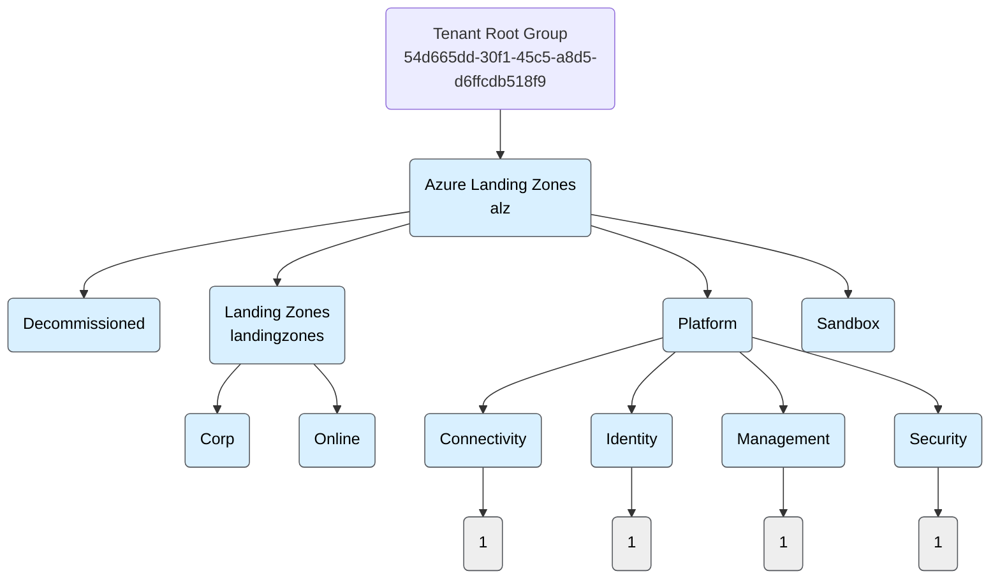

# Azure Governance Visualizer - Management Group Hierarchy

## HierarchyMap (Mermaid)

## Summary

Total Management Groups: 12 (depth 3)\
Total Subscriptions: 4\
Total Custom Policy definitions: 210\
Total Custom PolicySet definitions: 51\
Total Policy assignments: 161\
Total Policy assignments ManagementGroups 128\
Total Policy assignments Subscriptions 33\
Total Policy assignments ResourceGroups: 0\
Total Custom Role definitions: 9\
Total Role assignments: 452\
Total Role assignments (Tenant): 12\
Total Role assignments (ManagementGroups): 219\
Total Role assignments (Subscriptions): 174\
Total Role assignments (ResourceGroups and Resources): 47\
Total Blueprint definitions: 0\
Total Blueprint assignments: 0\
Total Resources: 327\
Total Resource Types: 18

## Hierarchy Table

| **MgLevel** | **MgName** | **MgId** | **MgParentName** | **MgParentId** | **SubName** | **SubId** |
|-------------|-------------|-------------|-------------|-------------|-------------|-------------|
| 1 | Azure Landing Zones | alz | Tenant Root Group | 54d665dd-30f1-45c5-a8d5-d6ffcdb518f9 | none | none |
| 2 | Decommissioned | decommissioned | Azure Landing Zones | alz | none | none |
| 2 | Landing Zones | landingzones | Azure Landing Zones | alz | none | none |
| 2 | Platform | platform | Azure Landing Zones | alz | none | none |
| 2 | Sandbox | sandbox | Azure Landing Zones | alz | none | none |
| 3 | Connectivity | connectivity | Platform | platform | azr-mge-dev-sub-04 | 399a72e1-30af-4a84-92ac-af885a677310 |
| 3 | Corp | corp | Landing Zones | landingzones | none | none |
| 3 | Identity | identity | Platform | platform | azr-mge-dev-sub-02 | 1c083bf3-30ac-4804-aa81-afddc58c78dc |
| 3 | Management | management | Platform | platform | azr-mge-dev-sub-03 | 8ff0bc40-d483-4e35-be1d-b49568bd9c5f |
| 3 | Online | online | Landing Zones | landingzones | none | none |
| 3 | Security | security | Platform | platform | azr-mge-dev-sub-05 | dee9fea3-65b6-45ad-8b44-f38b05c31fa9 |

